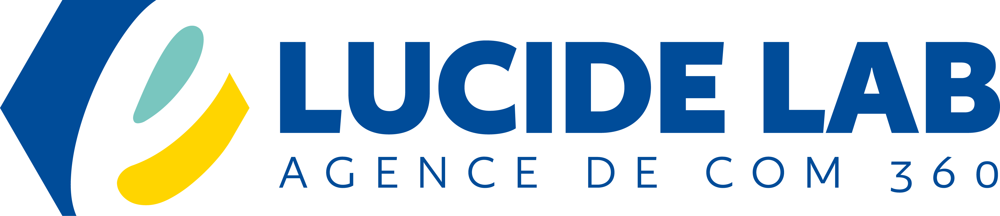

# 🚀 LUCIDE LAB — Site Web Officiel & Plateforme d'Expertise



**LUCIDE LAB** est un cabinet d'expertise en communication, branding et stratégie de croissance de marque basé à **Cotonou, Bénin**, et rayonnant à l'échelle de l'Afrique de l'Ouest francophone.

Ce projet constitue la plateforme web officielle de **LUCIDE LAB**, comprenant un site vitrine public moderne, 100% responsive et en pleine largeur (*Full Width*), connecté à une API REST d'administration dynamique.

---

## 🌟 Présentation de LUCIDE LAB

LUCIDE LAB accompagne les entreprises ambitieuses, les institutions et les startups à structurer leur vision, sublimer leur branding et accélérer leur développement grâce à 6 pôles d'expertise majeurs :

1. 🧭 **STRATEGY** — Direction stratégique, positionnement & plans de communication sur-mesure.
2. 🎨 **BRAND** — Identité de marque, charte graphique & design système haut de gamme.
3. 🌐 **DIGITAL** — Conception web, applications interactives & plateformes digitales.
4. 📈 **GROWTH** — Marketing de performance, SEO & stratégies d'acquisition.
5. 📝 **CONTENT** — Storytelling, création visuelle/vidéo & rédaction stratégique.
6. 📢 **ADVERTISING** — Campagnes publicitaires ciblées & achat média.

---

## 🛠️ Stack Technique

Le projet repose sur une **architecture découplée moderne et performante** :

```
lucideLab_Service/
├── front/     # Application Client React (Vite + TS)
└── back/      # Application Serveur API (Laravel)
```

### 💻 Frontend (`/front`)
- **Framework** : [React 18](https://react.dev/) + [TypeScript](https://www.typescriptlang.org/)
- **Build Tool** : [Vite](https://vitejs.dev/)
- **Navigation** : React Router DOM v6
- **Icônes** : [Lucide React](https://lucide.dev/)
- **Design & Styles** : Vanilla CSS 3 avec Design Système inspiré de Fludicial (`fludicial.css`)
- **Layout** : 100% Pleine Largeur (*Full Width*), barre de navigation fixe (*Sticky Navbar*), et responsivité totale (Desktop, Tablette, Mobile).

### ⚙️ Backend (`/back`)
- **Framework** : [Laravel 11 / 13](https://laravel.com/)
- **Architecture** : API RESTful (`/api/v1/...`) avec gestion CORS
- **Base de Données** : SQLite avec Eloquent ORM
- **Données de Démarrage** : Seeders automatisés pour la totalité des entités (`DatabaseSeeder.php`).

---

## 🎨 Charte Graphique & Identité Visuelle

- **Couleur Principale (Bleu Roi)** : `#0122bc` | `rgb(1, 34, 188)` | `hsl(229, 99%, 37%)`
- **Couleur d'Accentuation (Orange Vif)** : `#fd8604` | `rgb(253, 134, 4)` | `hsl(31, 98%, 50%)`
- **Typographies Officielles** : *Source Sans Pro* (Titres) & *Open Sans* (Corps de texte)
- **Composant Signature** : Horloge numérique en temps réel intégrée dans l'en-tête Topbar.

---

## 📁 Structure du Projet

```
lucideLab_Service/
│
├── front/                            # Projet React Frontend
│   ├── public/
│   │   └── assets/images/           # Favicon & Logo officiel (logo.png, Favicon .png)
│   ├── src/
│   │   ├── assets/css/
│   │   │   └── fludicial.css        # Système de design & variables de couleurs (#0122bc, #fd8604)
│   │   ├── components/
│   │   │   ├── common/              # Boutons d'action (CommonButton) & Horloge (DigitalClock)
│   │   │   └── layout/              # Topbar, Navbar fixe, Footer & AdminLayout
│   │   ├── pages/
│   │   │   ├── public/              # Home, Services, Realisations, About, Blog, Contact
│   │   │   └── admin/               # Dashboard, Services, Realisations, Blogs, Partners, Settings
│   │   ├── router/                  # Configuration des routes React Router
│   │   └── services/
│   │       └── api.ts               # Client HTTP de communication avec l'API Laravel
│   └── index.html
│
└── back/                             # Projet Laravel Backend
    ├── app/
    │   ├── Http/Controllers/Api/    # Contrôleurs API REST (Service, Realisation, Blog, Contact, etc.)
    │   └── Models/                  # Modèles Eloquent (Service, Realisation, Blog, Partner, Message)
    ├── database/
    │   ├── migrations/              # Migrations SQL de l'administration
    │   └── seeders/
    │       └── DatabaseSeeder.php   # Seeder global de la base de données
    └── routes/
        └── api.php                  # Endpoints REST API (/api/v1/...)
```

---

## 🚀 Installation & Lancement Rapide

### 1. Démarrage du Backend (Laravel API)

```bash
cd back
composer install
php artisan migrate:fresh --seed
php artisan serve --port=8000
```
> L'API sera accessible sur : `http://127.0.0.1:8000/api/v1/...`

### 2. Démarrage du Frontend (React + Vite)

```bash
cd front
npm install
npm run dev
```
> L'application client s'ouvrira sur : `http://localhost:5173/`

### 3. Compilation pour la Production

```bash
cd front
npm run build
```

---

## 🔐 Console d'Administration (`/admin`)

L'espace d'administration permet de gérer dynamiquement :
- Les **Pôles de services & compétences**
- Les **Réalisations & projets du portfolio**
- Les **Articles de blog & actualités**
- Les **Témoignages & secteurs partenaires**
- Les **Messages de contact reçus**
- Les **Paramètres généraux du site**

**Identifiants d'accès par défaut** :
- **Email** : `admin@lucidelab.com`
- **Mot de passe** : `password`

---

## 📞 Coordonnées du Cabinet

- **Téléphone** : `0166285017`
- **Email** : `lucidelabofficiel@gmail.com`
- **Adresse** : Cotonou, Bénin & Afrique de l'Ouest
